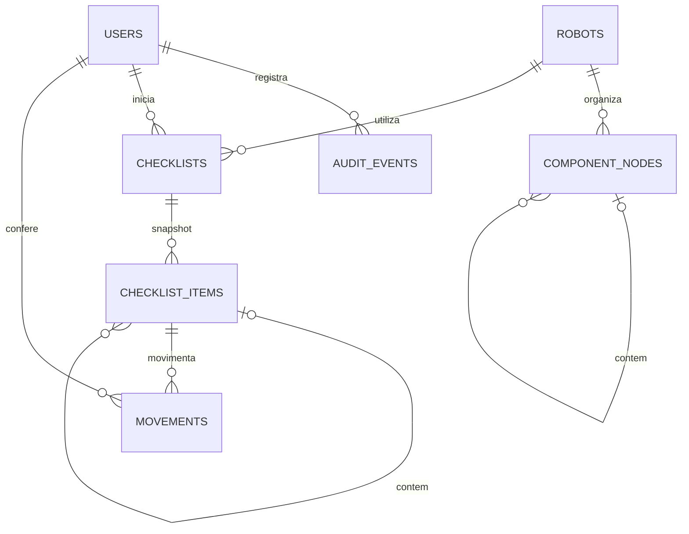

# Uso do RoboParts

Todas as telas de trabalho exigem uma conta de funcionário. O cadastro exige o código interno configurado no servidor; não há administrador nem diferenças de permissão entre os funcionários.

## Preparar uma retirada

1. Em **Robôs e componentes**, cadastre o robô com nome e descrição.
2. Abra sua estrutura. Crie categorias, subcategorias e componentes. Categorias também podem ficar na raiz.
3. Defina a quantidade necessária e se o componente é obrigatório. Componentes opcionais podem ser retirados, mas não impedem a finalização.
4. Clique no nome para renomear: Enter ou **Salvar nome** confirma; Escape cancela. A edição só é confirmada após a API salvar.
5. Em **Editar detalhes**, escolha uma categoria ativa do mesmo robô e a posição entre seus irmãos. Componentes não podem conter filhos. Ancestrais e descendentes não podem formar ciclos.
6. Elementos arquivados não entram nos próximos checklists. Arquivar uma categoria arquiva seus descendentes. Mostrar arquivados permite restaurar primeiro os ancestrais e depois os elementos desejados.

Não há nomes fixos nem robôs de demonstração no banco de produção. Os nomes usados nos testes são apenas fixtures isoladas.

## Conferir e devolver

**Iniciar retirada** cria um novo UUID de checklist. A estrutura inteira é copiada naquele momento: nome e descrição do robô, nomes e descrições de elementos, quantidades, obrigatoriedade, ordem e relações entre pais e filhos.

O checkbox retira a quantidade completa do componente. Para uma retirada parcial, preencha a quantidade absoluta atualmente retirada e clique em **Registrar**. Exemplo: registrar 2 após uma quantidade 1 acrescenta uma retirada de 1; registrar 0 após 2 registra devolução de 2. O servidor calcula o delta e registra o funcionário e o horário.

O progresso geral e por categoria considera os componentes obrigatórios totalmente retirados. Os filtros **Pendentes** e **Conferidos** ajudam na conferência. Categorias podem ser expandidas e recolhidas.

| Estado | Significado |
| --- | --- |
| Pendente | Checklist criado, sem componentes retirados |
| Em andamento | Há componentes retirados e a conferência ainda não foi finalizada |
| Retirada conferida | Todos os obrigatórios foram conferidos e alguém confirmou a finalização |
| Em devolução | A retirada foi finalizada e algumas quantidades foram devolvidas |
| Devolvido | Todas as quantidades de uma retirada finalizada voltaram a zero |
| Cancelado | Checklist sem finalização e sem quantidades retiradas foi cancelado |

A finalização exige todos os componentes obrigatórios e ao menos uma retirada. Depois dela, a quantidade só pode diminuir; uma nova retirada exige outro checklist. O horário e o responsável pela finalização permanecem registrados mesmo após todas as devoluções.

Renomear, mover, alterar quantidade ou arquivar a estrutura atual não modifica checklists anteriores. Cada checklist permanece independente. O sistema permite utilizações simultâneas registradas separadamente; ele não representa um estoque global nem permite deduzir disponibilidade física apenas da árvore.

## Histórico e indicadores

A página de checklists lista utilizações anteriores por data e pode ser filtrada pelo robô. Cada utilização mostra seu snapshot e todas as movimentações, com responsável e horário.

**Histórico da equipe** mostra ações de acesso, cadastro e edição, início de retirada, movimentação, finalização e cancelamento. **Apenas minhas atividades** usa a identidade da sessão. A API não aceita escolher outro funcionário para essa consulta.

| Indicador | Definição |
| --- | --- |
| Robôs cadastrados | Robôs ativos, excluindo arquivados |
| Robôs em uso | Robôs distintos com alguma quantidade retirada em qualquer checklist |
| Checklists em andamento | Checklists pendentes ou em andamento |
| Conferências completas | Checklists que tiveram finalização, inclusive os posteriormente devolvidos |
| Componentes pendentes | Itens obrigatórios ainda incompletos em checklists pendentes ou em andamento |

Nenhum indicador representa montagem ou fabricação. Os números vêm do banco; quando a API falha, a interface mostra indisponibilidade.

## Consistência e auditoria

Cada escrita de estrutura bloqueia o robô; cada movimentação ou encerramento bloqueia o checklist. O cliente envia a versão que estava vendo. Uma versão antiga produz HTTP 409 e não substitui as mudanças de outro funcionário. Atualize, confira o estado e salve novamente.

Criação de checklist e movimentação recebem um UUID de operação. Repetir a mesma solicitação retorna o resultado atual sem duplicar registros. Reutilizar o UUID com outro funcionário, item ou quantidade é rejeitado. A interface não repete POST automaticamente; quando permite tentar uma operação cuja resposta se perdeu, conserva seu identificador.

Quantidades não podem ser negativas, fracionárias ou exceder o necessário. As estruturas têm no máximo 1000 elementos e 32 níveis. Relações entre robôs diferentes, pais que sejam componentes e ciclos são rejeitados.

Identidades vêm da sessão no backend. Movimento, atualização e auditoria pertencem à mesma transação. Auditoria e movimentos são imutáveis pela API e por gatilhos PostgreSQL; os campos estruturais do snapshot também são protegidos. Alterações de quantidade retirada e responsável continuam disponíveis nos itens do checklist.

## Modelo de dados

Os itens copiados preservam o UUID de origem para rastreabilidade, sem depender dos valores atuais da estrutura. O snapshot tem seus próprios IDs de pai e filho. Checklists e movimentos não são sobrescritos por novas utilizações.

## Verificação pendente no ambiente real

Os testes automatizados usam H2 no backend e uma API simulada no frontend. Eles não validam os gatilhos do PostgreSQL 18. Após corrigir a ordem de inicialização, o log local confirmou a conexão ao banco `roboparts` no PostgreSQL 18.6, a aplicação de V1/V2/V3 e a inicialização do backend. Os fluxos específicos dos gatilhos ainda exigem validação no PostgreSQL.

Depois de configurar a senha localmente, execute a inspeção de leitura descrita no README e inicie o backend. A inspeção prévia ao Flyway verifica nome, versão e objetos existentes antes de aplicar V1/V2/V3. Os testes PostgreSQL opcionais continuam somente leitura e exigem que o schema já tenha sido migrado.

O ambiente de ferramentas não disponibilizou navegador para inspeção visual. Conferência em computador, celular/tablet e instalação PWA permanecem verificações manuais. O PWA guarda apenas a interface pública; cadastro, login, consultas e alterações exigem conexão com a API.
