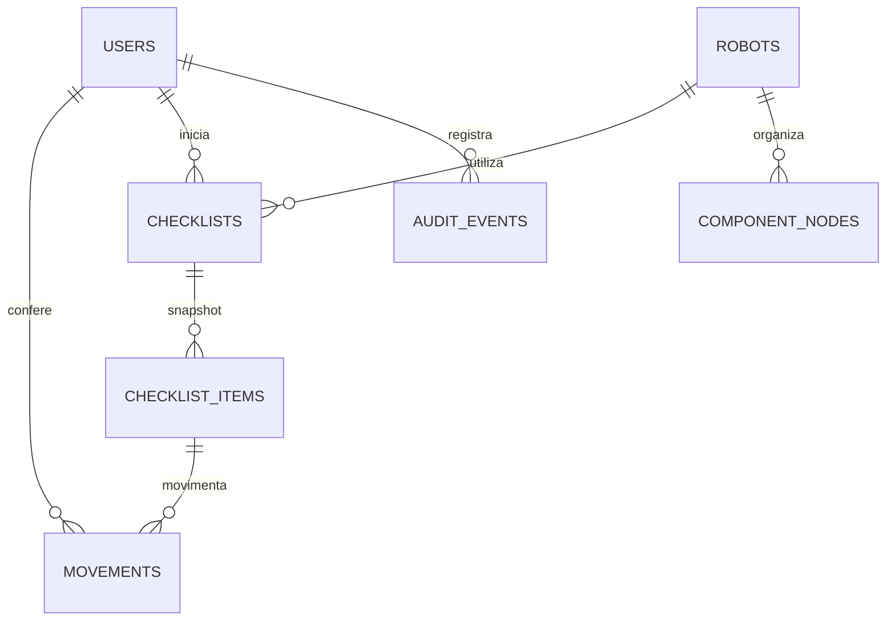

# Uso do RoboParts

Todas as telas de trabalho exigem uma conta de funcionário. O cadastro exige o código interno configurado no servidor; não há administrador nem diferenças de permissão entre os funcionários.

## Preparar uma retirada

1. Em **Robôs e componentes**, cadastre o robô com nome e descrição.
2. Abra o robô e use **Adicionar componente** para cadastrar as peças diretamente na sua lista.
3. Defina a quantidade necessária e se o componente é obrigatório. Componentes opcionais podem ser retirados, mas não impedem a finalização.
4. Clique no nome para renomear: Enter ou **Salvar nome** confirma; Escape cancela. A edição só é confirmada após a API salvar.
5. Abra os detalhes do componente para alterar nome, descrição, quantidade, obrigatoriedade e posição na lista.
6. Componentes arquivados não entram nos próximos checklists. Use **Mostrar arquivados** para restaurá-los individualmente.

O robô só pode ser arquivado quando não houver componentes retirados em nenhum dos seus checklists. Ao tentar arquivar um robô em uso, a tela informa que é necessário concluir a devolução de todos os componentes. Finalizar a conferência ou devolver apenas parte das peças mantém esse bloqueio. Alterações de nome e descrição continuam disponíveis durante o uso.

Não há nomes fixos nem robôs de demonstração no banco de produção. Os nomes usados nos testes são apenas fixtures isoladas.

## Conferir e devolver

**Iniciar retirada** cria um novo UUID de checklist. A lista de componentes ativos é copiada naquele momento: nome e descrição do robô, nomes e descrições dos componentes, quantidades, obrigatoriedade e ordem.

O checkbox retira a quantidade completa do componente. Para uma retirada parcial, preencha a quantidade absoluta atualmente retirada e clique em **Registrar**. Exemplo: registrar 2 após uma quantidade 1 acrescenta uma retirada de 1; registrar 0 após 2 registra devolução de 2. O servidor calcula o delta e registra o funcionário e o horário.

Na retirada, o progresso considera os componentes obrigatórios totalmente retirados. Os filtros **Pendentes** e **Conferidos** ajudam na conferência. Todos os componentes aparecem em uma lista única.

Clique em **Confirmar retirada** e depois em **Confirmar**. O status passa a **Em uso** e a tela abre automaticamente o **Checklist de devolução**. As caixas começam desmarcadas: marcar uma peça registra a devolução de todas as unidades restantes dela. Para devolver apenas parte, informe quantas unidades está devolvendo no campo de quantidade e clique em **Devolver**. Após cada devolução, o campo volta a zero e seu limite passa a ser a quantidade que ainda falta devolver.

O progresso da devolução conta todas as peças que foram retiradas, incluindo as opcionais. Use **A devolver** e **Devolvidos** para filtrar. Peças opcionais que não foram retiradas não entram na devolução. Uma devolução parcial mantém o status **Em devolução**; devolver todas as peças encerra o uso com status **Devolvido**. Peças devolvidas ficam marcadas e não podem ser retiradas novamente neste checklist.

| Estado | Significado |
| --- | --- |
| Pendente | Checklist criado, sem componentes retirados |
| Em andamento | Há componentes retirados e a conferência ainda não foi finalizada |
| Em uso | A retirada foi confirmada; o checklist de devolução está disponível |
| Em devolução | A retirada foi finalizada e algumas quantidades foram devolvidas |
| Devolvido | Todas as quantidades de uma retirada finalizada voltaram a zero |
| Cancelado | Checklist sem finalização e sem quantidades retiradas foi cancelado |

A confirmação exige todos os componentes obrigatórios e ao menos uma retirada. Depois dela, apenas devoluções são permitidas; uma nova retirada exige outro checklist. O horário e o responsável pela confirmação permanecem registrados mesmo após todas as devoluções.

Renomear, reordenar, alterar quantidade ou arquivar a estrutura atual não modifica checklists anteriores. Cada checklist permanece independente. O sistema permite utilizações simultâneas registradas separadamente; ele não representa um estoque global nem permite deduzir disponibilidade física apenas da lista de componentes.

## Histórico e indicadores

A página de checklists lista utilizações anteriores por data e pode ser filtrada pelo robô. Cada utilização mostra seu snapshot e todas as movimentações, com responsável e horário.

**Histórico da equipe** mostra ações de acesso, cadastro e edição, início de retirada, movimentação, finalização e cancelamento. **Apenas minhas atividades** usa a identidade da sessão. A API não aceita escolher outro funcionário para essa consulta.

| Indicador | Definição |
| --- | --- |
| Robôs cadastrados | Robôs ativos, excluindo arquivados |
| Robôs em uso | Robôs distintos com alguma quantidade retirada em qualquer checklist |
| Checklists em andamento | Checklists pendentes ou em andamento |
| Conferências completas | Checklists que tiveram finalização, inclusive os posteriormente devolvidos |
| Componentes pendentes | Itens obrigatórios ainda incompletos em checklists pendentes ou em andamento |

Nenhum indicador representa montagem ou fabricação. Os números vêm do banco; quando a API falha, a interface mostra indisponibilidade.

## Consistência e auditoria

Cada escrita de estrutura bloqueia o robô; cada movimentação ou encerramento bloqueia o checklist. O cliente envia a versão que estava vendo. Uma versão antiga produz HTTP 409 e não substitui as mudanças de outro funcionário. Atualize, confira o estado e salve novamente.

Criação de checklist e movimentação recebem um UUID de operação. Repetir a mesma solicitação retorna o resultado atual sem duplicar registros. Reutilizar o UUID com outro funcionário, item ou quantidade é rejeitado. A interface não repete POST automaticamente; quando permite tentar uma operação cuja resposta se perdeu, conserva seu identificador.

Quantidades não podem ser negativas, fracionárias ou exceder o necessário. Cada robô aceita até 1000 componentes, associados diretamente a ele. A API rejeita a criação de grupos e associações entre componentes.

Identidades vêm da sessão no backend. Movimento, atualização e auditoria pertencem à mesma transação. Auditoria e movimentos são imutáveis pela API e por gatilhos PostgreSQL; os campos estruturais do snapshot também são protegidos. Alterações de quantidade retirada e responsável continuam disponíveis nos itens do checklist.

## Modelo de dados

Os itens copiados preservam o UUID de origem para rastreabilidade, sem depender dos valores atuais da estrutura. Checklists e movimentos não são sobrescritos por novas utilizações. Estruturas antigas são apresentadas como listas de componentes; seus dados e registros históricos permanecem no banco. Novos checklists copiam apenas os componentes ativos, sem agrupamento.

## Verificação pendente no ambiente real

Os testes automatizados usam H2 no backend e uma API simulada no frontend. Eles não validam os gatilhos do PostgreSQL 18. Após corrigir a ordem de inicialização, o log local confirmou a conexão ao banco `roboparts` no PostgreSQL 18.6, a aplicação de V1/V2/V3 e a inicialização do backend. Os fluxos específicos dos gatilhos ainda exigem validação no PostgreSQL.

Depois de configurar a senha localmente, execute a inspeção de leitura descrita no README e inicie o backend. A inspeção prévia ao Flyway verifica nome, versão e objetos existentes antes de aplicar V1/V2/V3. Os testes PostgreSQL opcionais continuam somente leitura e exigem que o schema já tenha sido migrado.

O ambiente de ferramentas não disponibilizou navegador para inspeção visual. Conferência em computador, celular/tablet e instalação PWA permanecem verificações manuais. O PWA guarda apenas a interface pública; cadastro, login, consultas e alterações exigem conexão com a API.
